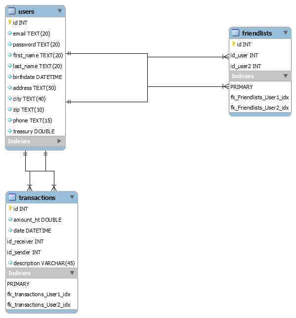
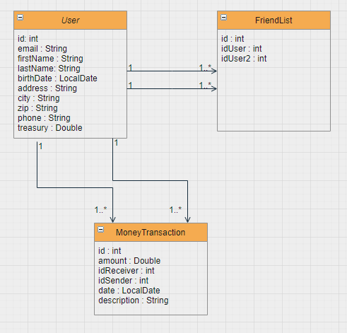

# PayMyBuddy

## Table of Content
* [Technical Informations](#1-technical-informations)</br>
    * [Requirements](#11-requirements)
    * [Diagrams](#12-diagrams)
    * [Sql Scripts](#13-sql-scripts)
    * [Installation](#14-installation)
  
* [End Points](#2-endpoints)</br>
    * [User](#21-user)
    * [Money Transaction](#22-money-transactions)
    * [FriendList](#23-friend-list)

* [Format](#3-format)</br>
    * [User](#31-user-format)
    * [Money Transaction](#32-moneytransation-format)
    * [FriendList](#33-friendlist-format)
  
    

## Description

DAL for PayMyBuddy, an app use for money transferts between friends
</br>
</br>

## 1. Technical informations

### 1.1 Requirements


</br>
</br>

### 1.2 Diagrams



</br>
</br>

### 1.3 SQL Scripts

In the SQL folder you have two script:

* sql_empty_init.sql containing and empty database
* pay_my_buddy.sql containing database with test ressources.
  </br>
  </br>

### 1.4 Installation
* Export project with:
```bash
mvn clean
mvn install
```
As Tomcat is embbeded, you can launch directly the *.jar with
```bash
java -jar {nameOfTheFile}.jar
```

## 2. Endpoints
### 2.1 User
```html
<!-- Return user for given id -->
GET -> /users/{id}
<!-- Return user for given email -->
GET -> /users?email=EMAIL
<!-- Post new user -->
POST -> /users
<!-- Delete user for given email -->
DELETE -> /users?email=EMAIL
<!-- Save an existing user -->
PUT -> /users
```
### 2.2 Money Transactions
```html
<!-- Post new Transaction -->
POST -> /moneyTransaction/
<!-- Get money transaction by its id -->
GET -> /moneyTransaction?id=ID
<!-- Use to withdraw money. No bank transactions implemented -->
PUT -> /moneyTransaction/withdraw
```

### 2.3 Friend List
```html
<!-- Post new friendship -->
POST -> /friends?userId=ID?userId2=ID2
<!-- Get a List with all Friends for given user id -->
GET -> /friends?userId=ID
<!-- Delete a friend relation between the given two user, only on userID side. -->
DELETE -> /friends?userId=ID?userId2=ID2
```

## 3 Format
### 3.1 User format
For creating new user, id is autogenerated and not required. But to modify ( put) a user, the id 
is required as it might create a new user instead.
```json
{
    "id":"",
    "firstName":"",
    "lastName":"",
    "email":"",
    "password":"",
    "address":"",
    "city":"",
    "zip":"",
    "phone":"",
    "birthDate":"",
    "treasury":""

      
}
```
### 3.2 MoneyTransation format
```json
{
    "amount":"",
    "idReceiver":"",
    "idSender":"",
    "date":"",
    "description":""      
}
```
### 3.3 FriendList format
On return a friendList, all information except firstName, lastName and email, are setted to null,
to avoid personnal information leak like adress and password.
```json
{
        "id": null,
        "firstName": "",
        "lastName": "",
        "email": "",
        "password": null,
        "address": null,
        "city": null,
        "zip": null,
        "phone": null,
        "birthDate": null,
        "treasury": null
    }
```


